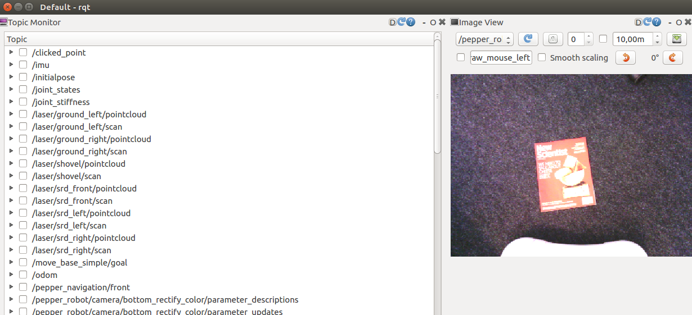

# pepper-scripts

A repository for the pepper robot scripts.

---

**Installation procedure**

 0) Instal [ROS Kinetic](http://wiki.ros.org/kinetic/Installation), if you are using Ubuntu 16.04.  
1) Follow intruction to install in [this](http://wiki.ros.org/pepper/Tutorial_kinetic) link to install Pepper ros packages.  
2) You need to bring up the robot with all sensor and actuators by typing 
```
roscore # in a terminal, the open a new terminal

$ roslaunch pepper_bringup pepper_full_py.launch nao_ip:=192.168.26.135 roscore_ip:=192.168.26.157

```
3) Alternatively you can add the following line to your .bashrc
```
alias bringp="roslaunch pepper_bringup pepper_full_py.launch nao_ip:=192.168.XX.YYY roscore_ip:=192.168.XX.ZZZ"

# then source your bashrc
$ source ~/.bashrc
```
4) List all available topics published by the robot.
```
$ rostopic list

/cmd_vel
/imu
/joint_states
/joint_stiffness
/laser/ground_left/pointcloud
/laser/ground_left/scan
/laser/ground_right/pointcloud
/laser/ground_right/scan
/laser/shovel/pointcloud
/laser/shovel/scan
/laser/srd_front/pointcloud
/laser/srd_front/scan
/laser/srd_left/pointcloud
/laser/srd_left/scan
/laser/srd_right/pointcloud
/laser/srd_right/scan
/move_base_simple/goal
/odom

.........
```
4.1) Choose one of the published topics and display the messages.
```
rostopic echo /pepper_robot/camera/front/camera/image_raw
```
5) You can also check the 4. and 4.1 steps from **rqt**.

 (assets/rqt.png)
